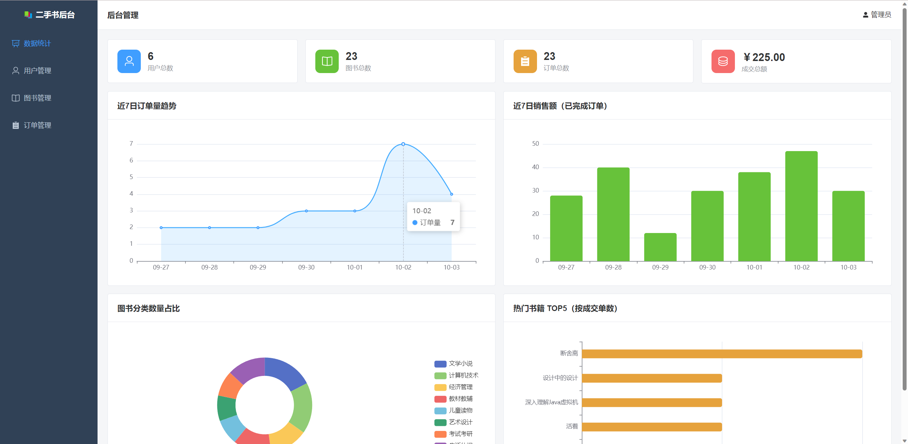
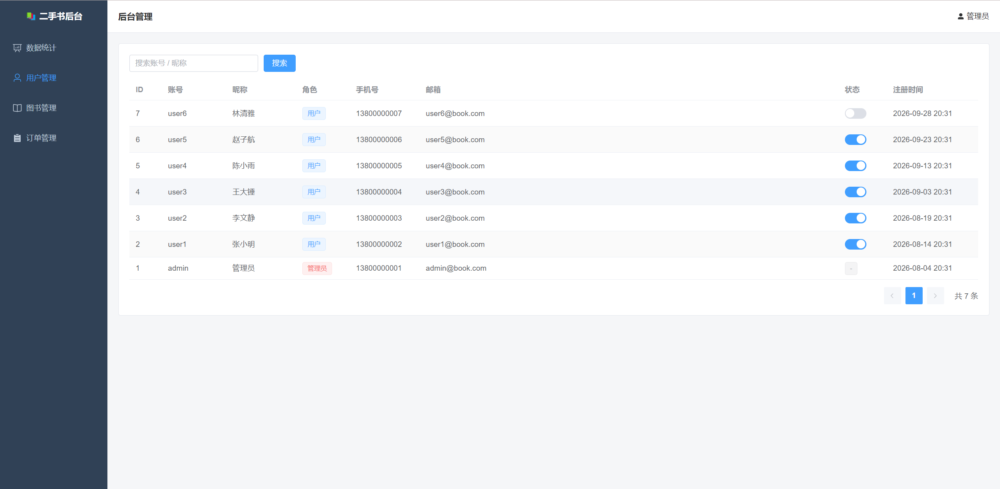
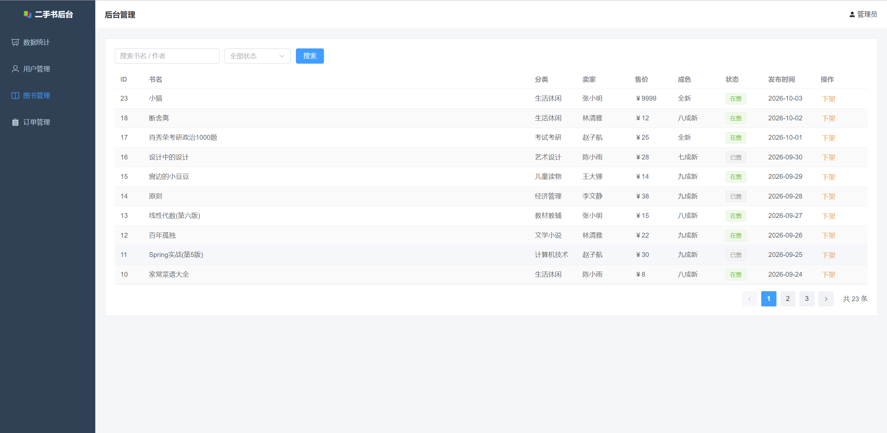
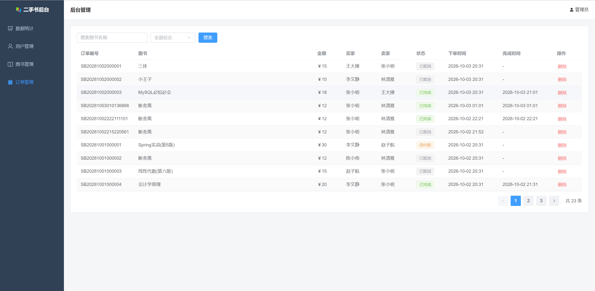
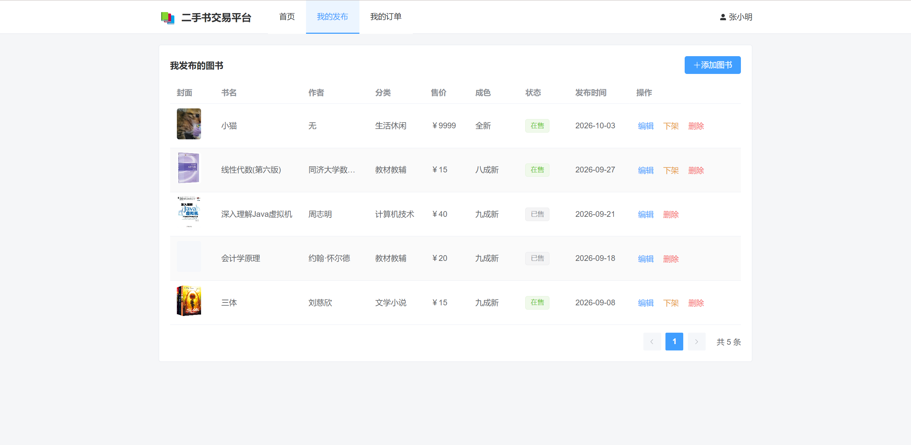
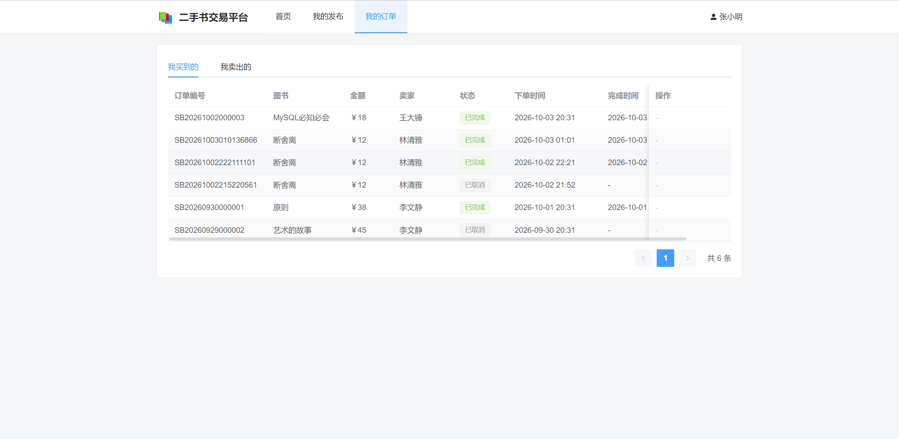
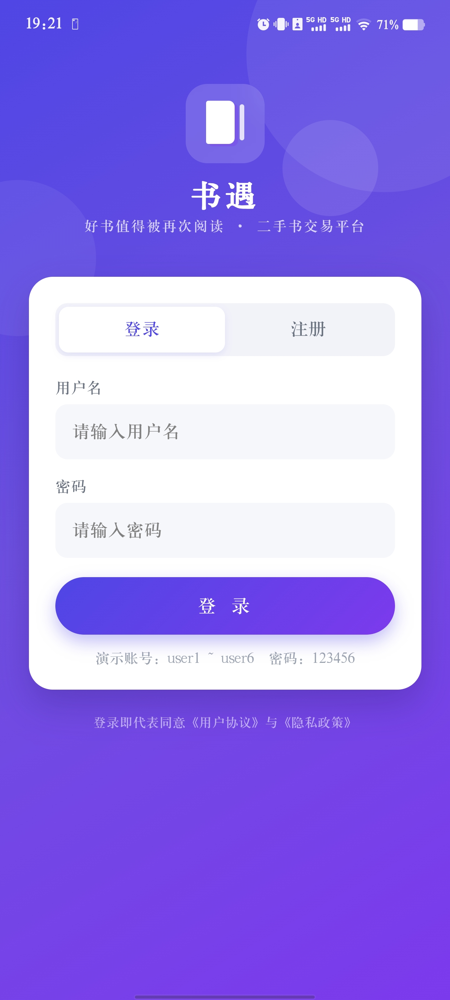
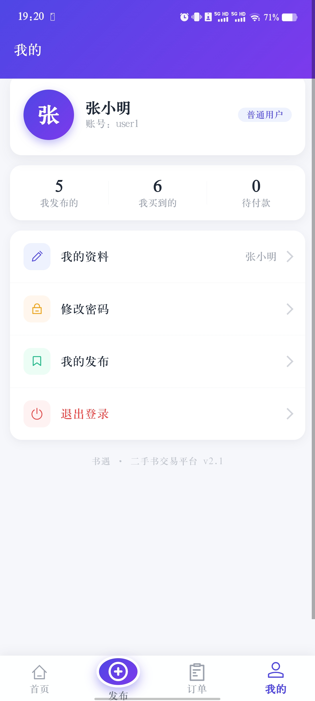
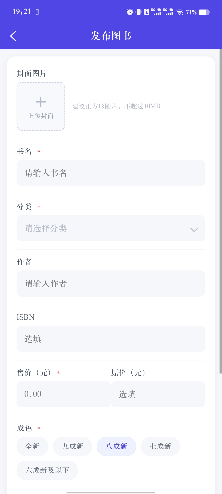
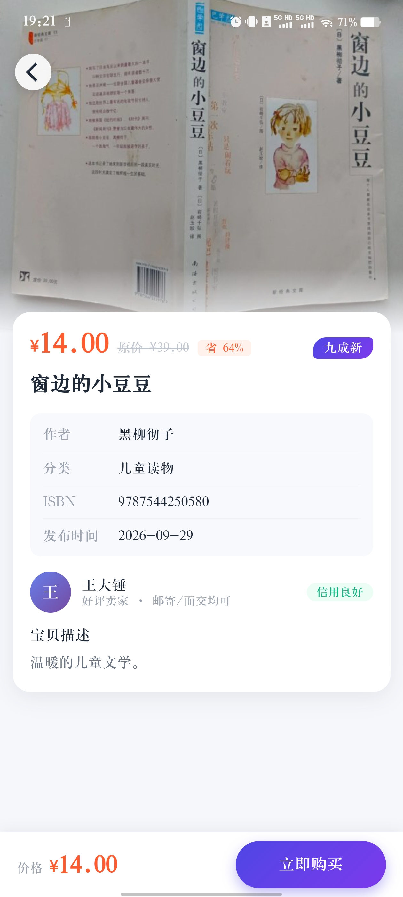

# 二手书交易平台（书遇）

> 基于 Spring Boot + Vue 3 + uni-app 的二手书综合交易平台 


## ！！！项目定位！！！

本项目旨在验证与调试 **AI 辅助编程**的可行性。网页端（PC 端）仅设计了最基础的功能作为对照基准；手机端 App 的设计与实现则完全借助 AI 完成（`app-AI` 目录下的代码均由 AI 生成），并通过多轮 Prompt 调试持续迭代优化，最终达到了较为理想的页面效果与交互体验。


## 项目简介

**二手书交易平台（书遇）** 是一套面向校园与日常场景的二手图书交易解决方案，覆盖二手书从发布、浏览、购买到订单管理的全流程闭环。系统采用前后端分离架构，提供 **PC 管理端、PC 用户端、移动端三套入口，实现一套后端服务多端复用。

系统围绕二手书的**交易事务**展开——从卖家发布图书、买家搜索淘书、下单付款，到订单状态流转、个人资产管理，全方位数字化二手书交易生态。

------

## 技术栈

- **后端**：Spring Boot、JDK 17、Maven、MyBatis-Plus、MySQL、Lombok
- **PC 前端**：Vue、Vite、Element Plus、Vue Router、Axios、ECharts
- **移动端（uni-app）**：uni-app、Vite、wot-design-uni、Sass

------

## 功能模块

### 前台用户端（PC / 移动端）

- **登录注册**：账号密码登录、用户注册、退出登录
- **图书浏览**：图书列表、关键词搜索（书名 / 作者 / ISBN）、分类筛选
- **图书详情**：封面、价格与原价对比、成色、图书描述、卖家信息
- **下单购买**：立即购买生成订单，待付款订单支持付款与取消
- **我的订单**：我买到的 / 我卖出的双视角，按状态（待付款 / 已完成 / 已取消）筛选
- **我的发布**：发布二手书（含封面上传）、编辑、上架 / 下架、删除
- **个人中心**：昵称 / 手机号 / 邮箱资料修改、密码修改

### 管理后台（PC）

- **数据看板**：ECharts 可视化统计（销售趋势、分类分布、经营指标）
- **用户管理**：用户查询、账号启用 / 禁用
- **图书管理**：全站图书查询与下架处理
- **分类管理**：图书分类维护
- **订单管理**：全站订单查询与状态管理

------

## 角色权限

| 角色                 | 职责范围                                                       |
| -------------------- | -------------------------------------------------------------- |
| **管理员 (admin)**   | 数据看板、用户管理、图书管理、分类管理、订单管理等全功能       |
| **普通用户 (user)**  | 图书浏览搜索、发布图书、购买下单、订单管理、个人中心           |

------

## 项目结构

```
second-hand-book-trading-platform
├── pom.xml                              # Maven 依赖配置
├── mvnw.cmd / mvnw                      # Maven 包装器
├── uploads/                             # 图书封面等上传文件目录
├── src/main/java/com/code/secondhandbooktradingplatform
│   ├── common/                          # 通用返回体 (Result 等)
│   ├── config/                          # 配置类 (MybatisPlus, Web)
│   ├── controller/                      # 控制器层 (Auth, Book, Category, Order, User, Admin, File)
│   ├── dto/                             # 数据传输对象
│   ├── entity/                          # 实体类 (User, Book, Category, Order)
│   ├── interceptor/                     # 登录鉴权拦截器
│   ├── mapper/                          # MyBatis-Plus Mapper 接口
│   ├── service/                         # 业务逻辑层
│   └── vo/                              # 视图对象
├── src/main/resources
│   ├── application.yml                  # 应用配置（端口 / 数据源 / 上传目录）
│   ├── db
│   │   ├── schema.sql                   # 建库建表脚本（启动自动执行）
│   │   └── data.sql                     # 种子数据脚本（启动自动执行）
│   ├── frontend/                        # PC 前端源码 (Vue 3)
│   │   └── src
│   │       ├── layouts/                 # 布局组件
│   │       ├── router/                  # 路由配置
│   │       ├── utils/                   # 工具函数 (Axios 封装等)
│   │       └── views
│   │           ├── admin/               # 管理端页面 (看板/用户/图书/订单)
│   │           └── front/               # 用户端页面 (首页/我的发布/我的订单/个人中心)
│   └── static/                          # 前端构建产物（由后端托管）
│       └── m/                           # 移动端 H5 构建产物
└── app-AI                               # 移动端项目 (uni-app, Vue 3)
    └── src
        ├── components/                  # 公共组件 (自定义导航栏 / 底部导航)
        ├── pages/                       # 页面 (首页/详情/发布/编辑/订单/我的/登录)
        ├── utils/                       # 请求封装 (Cookie 适配) 与工具函数
        └── static/                      # 静态资源
```

------

## 快速开始

### 环境要求

- JDK 17+
- MySQL 8.x
- Node.js 18+
- Maven、npm

### 1. 配置数据库连接

编辑 `src/main/resources/application.yml`，修改数据库连接信息：

```yaml
spring:
  datasource:
    url: jdbc:mysql://localhost:3306/secondhand_book?createDatabaseIfNotExist=true&useUnicode=true&characterEncoding=utf8&serverTimezone=Asia/Shanghai&useSSL=false&allowPublicKeyRetrieval=true
    username: root
    password: "123456"
```

### 2. 启动后端

在 IntelliJ IDEA 中打开项目根目录，直接运行主启动类即可。

后端服务默认启动在 `http://localhost:8080`，启动后自动完成数据库初始化。

### 3. 访问各端

**PC端**

进入 `src/main/resources/frontend` 目录，执行

```
npm install && npm run dev
npm run build
```

访问链接：` http://localhost:5173/` 

**移动端App**

- apk在 `app-AI/apk` 目录下，下载即可
> 手机真机访问：手机与电脑连同一网络，使用电脑局域网 IP 访问（如 `http://192.168.x.x:8080/m/index.html`），必要时放行防火墙 8080 端口。

------

## 默认账号

| 角色       | 用户名      | 密码       |
| ---------- | ----------- | ---------- |
| 管理员     | `admin`     | `123456`   |
| 普通用户   | `user1` ~ `user6` | `123456` |

> 内置 22 本二手书与 20 条订单记录，方便直接体验完整功能。

------

## 数据库表结构

| 表名       | 说明                     |
| ---------- | ------------------------ |
| `user`     | 用户表（管理员/普通用户） |
| `category` | 图书分类表               |
| `book`     | 图书表（二手书商品）     |
| `orders`   | 订单表（买卖交易记录）   |

------

## 项目截图

PC端管理员










PC端普通用户






移动端普通用户










## 说明

- `app-AI` 目录全部代码由 AI 生成，人工仅参与需求描述、Prompt 调试与效果验收，是本项目中 AI 辅助编程可行性的核心验证部分。

## 开源协议

[MIT](LICENSE)
